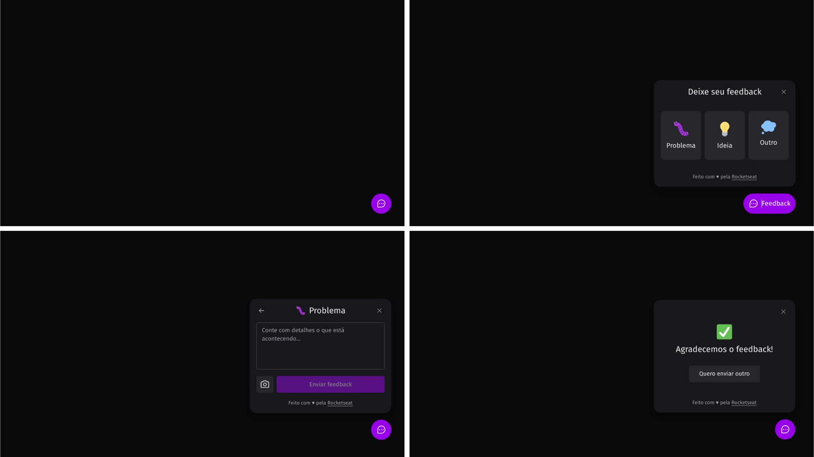

<h1 align="center">Widget feedback - NLW return</h1>



## :sparkles: Tecnologias

Esse projeto foi desenvolvido com as seguintes tecnologias:

- [ReactJs](https://reactjs.org/)
- [Typescript](https://www.typescriptlang.org/)
- [Axios](https://axios-http.com/ptbr/)
- [Prisma](https://www.prisma.io/)
- [CORS](https://www.npmjs.com/package/nextjs-cors)

## :computer: Projeto

Widget feedback ideal para receber ideias, algum problema na página ou outros tipos de feedbacks.

## :rocket: Como executar

```sh
# Clone o repositório
git clone https://github.com/Feliper-Silva/return-web.git
```

```sh
# baixar dependências
npm install
```

Crie as chaves no arquivo .env

```sh
# iniciar a aplicação.
npm run dev
```

Por fim, a aplicação estará disponível em http://localhost:3000

## :page_facing_up: Licença

Esse projeto está sob a licença MIT. Veja o arquivo [LICENSE](LICENSE.md) para mais detalhes.
